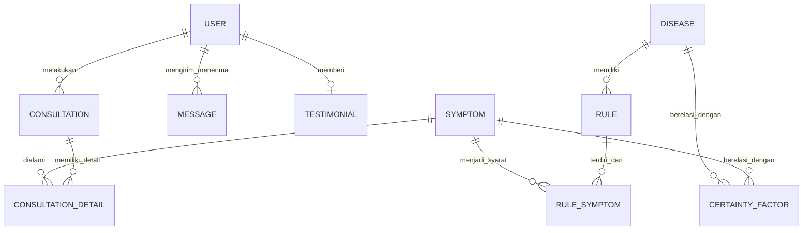

# Daftar Tabel, Kolom, dan Relasi Database

Berikut adalah ringkasan daftar tabel (Model Django) yang digunakan pada backend beserta daftar kolom (arti dalam bahasa Indonesia) dan relasi antar tabelnya.

| Nama Tabel | Deskripsi Singkat | Daftar Kolom Utama & Artinya | Relasi (Foreign Key / One-to-One / Many-to-Many) |
| --- | --- | --- | --- |
| **`User`** | Menyimpan data autentikasi & role (Admin/User/Health Worker). | - `role`: Peran pengguna - `full_name`: Nama lengkap - `profile_picture`: Foto profil | - `1:N` ke `Consultation` (sebagai pasien) - `1:N` ke `Message` (sebagai pengirim/penerima) - `1:1` ke `Testimonial` |
| **`Symptom`** | Master data gejala penyakit ISPA. | - `code`: Kode gejala (misal: S01) - `name`: Nama gejala - `description`: Penjelasan gejala | - `1:N` ke `RuleSymptom` - `1:N` ke `CertaintyFactor` - `1:N` ke `ConsultationDetail` |
| **`Disease`** | Master data jenis penyakit ISPA & solusinya. | - `code`: Kode penyakit (misal: P01) - `name`: Nama penyakit - `category`: Kategori penyakit - `description`: Deskripsi - `recommendation`: Rekomendasi medis - `treatment_solutions`: Solusi pengobatan - `recovery_steps`: Langkah pemulihan | - `1:N` ke `Rule` - `1:N` ke `CertaintyFactor` |
| **`Rule`** | Aturan IF-THEN (Forward Chaining) untuk penyakit tertentu. | - `code`: Kode aturan (misal: R01) | - `N:1` ke `Disease` - `1:N` ke `RuleSymptom` |
| **`RuleSymptom`** | Tabel perantara antara Rule dan Symptom (kondisi IF). | - `rule_id`: ID Aturan terkait - `symptom_id`: ID Gejala terkait | - `N:1` ke `Rule` - `N:1` ke `Symptom` |
| **`CertaintyFactor`** | Matriks bobot pakar (CF Expert) untuk gejala dan penyakit. | - `expert_cf`: Nilai probabilitas/bobot kepastian dari pakar (0 s.d 1) | - `N:1` ke `Disease` - `N:1` ke `Symptom` |
| **`DatasetRow`** | Data latih rekam medis/kasus diagnosis historis. | - `age`: Usia pasien historis - *[flag gejala]*: Nilai 0/1 jika gejala dialami - `diagnosis`: Hasil penyakit akhir | *(Tidak memiliki relasi langsung, digunakan untuk K-NN/Cosine)* |
| **`Consultation`** | Histori/sesi konsultasi pasien dengan hasil akhirnya. | - `consultation_date`: Waktu melakukan konsultasi - `final_diagnosis`: Hasil diagnosis akhir penyakit - `confidence_result`: Persentase hasil keyakinan - `age`: Usia pasien saat itu | - `N:1` ke `User` - `1:N` ke `ConsultationDetail` |
| **`ConsultationDetail`** | Detail gejala yang dipilih pasien pada satu sesi konsultasi. | - `user_cf`: Bobot kepastian/keyakinan dari pasien (misal: "Sangat Yakin") | - `N:1` ke `Consultation` - `N:1` ke `Symptom` |
| **`Message`** | Data obrolan (chat) antar pengguna (Pasien & Pakar). | - `content`: Isi pesan obrolan - `timestamp`: Waktu pesan dikirim - `is_read`: Status apakah pesan sudah dibaca | - `N:1` ke `User` (Sender) - `N:1` ke `User` (Receiver) |
| **`Testimonial`** | Rating dan ulasan dari pasien terkait platform. | - `rating`: Penilaian (bintang) - `content`: Isi ulasan / review - `created_at`: Waktu ulasan dibuat | - `1:1` ke `User` |
| **`HealthExpert`** | Profil pakar medis/dokter referensi CF. | - `name`: Nama lengkap pakar - `profession`: Pekerjaan/profesi pakar - `workplace`: Tempat bekerja medis - `notes`: Catatan referensi/sumber | *(Tabel referensi mandiri, tidak berelasi langsung dengan inti logic)* |

## Diagram Relasi Sederhana

