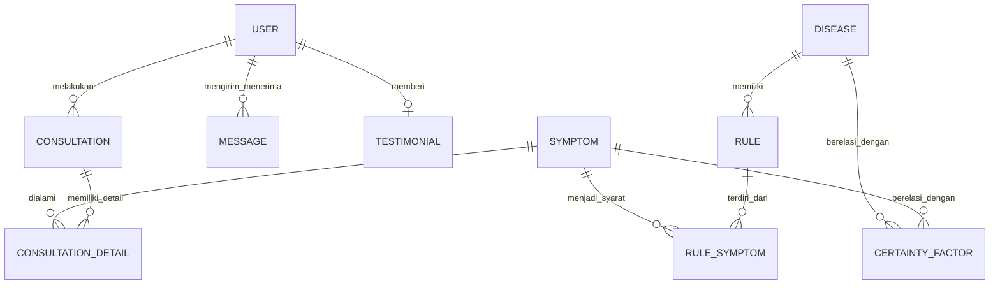

# Daftar Tabel dan Relasi Database

Berikut adalah ringkasan daftar tabel (Model Django) yang digunakan pada backend beserta relasi antar tabelnya.

| Nama Tabel | Deskripsi Singkat | Relasi (Foreign Key / One-to-One / Many-to-Many) |
| --- | --- | --- |
| **`User`** | Menyimpan data autentikasi & role (Admin/User/Health Worker). | - `1:N` ke `Consultation` (sebagai pasien) - `1:N` ke `Message` (sebagai pengirim/penerima) - `1:1` ke `Testimonial` |
| **`Symptom`** | Master data gejala penyakit ISPA. | - `1:N` ke `RuleSymptom` - `1:N` ke `CertaintyFactor` - `1:N` ke `ConsultationDetail` |
| **`Disease`** | Master data jenis penyakit ISPA & solusinya. | - `1:N` ke `Rule` - `1:N` ke `CertaintyFactor` |
| **`Rule`** | Aturan IF-THEN (Forward Chaining) untuk penyakit tertentu. | - `N:1` ke `Disease` - `1:N` ke `RuleSymptom` |
| **`RuleSymptom`** | Tabel perantara antara Rule dan Symptom (kondisi IF). | - `N:1` ke `Rule` - `N:1` ke `Symptom` |
| **`CertaintyFactor`** | Matriks bobot pakar (CF Expert) untuk gejala dan penyakit. | - `N:1` ke `Disease` - `N:1` ke `Symptom` |
| **`DatasetRow`** | Data latih rekam medis/kasus diagnosis historis. | *(Tidak memiliki relasi langsung, digunakan untuk K-NN/Cosine)* |
| **`Consultation`** | Histori/sesi konsultasi pasien dengan hasil akhirnya. | - `N:1` ke `User` - `1:N` ke `ConsultationDetail` |
| **`ConsultationDetail`** | Detail gejala yang dipilih pasien pada satu sesi konsultasi. | - `N:1` ke `Consultation` - `N:1` ke `Symptom` |
| **`Message`** | Data obrolan (chat) antar pengguna (Pasien & Pakar). | - `N:1` ke `User` (Sender) - `N:1` ke `User` (Receiver) |
| **`Testimonial`** | Rating dan ulasan dari pasien terkait platform. | - `1:1` ke `User` |
| **`HealthExpert`** | Profil pakar medis/dokter referensi CF. | *(Tabel referensi mandiri, tidak berelasi langsung dengan inti logic)* |

## Diagram Relasi Sederhana

